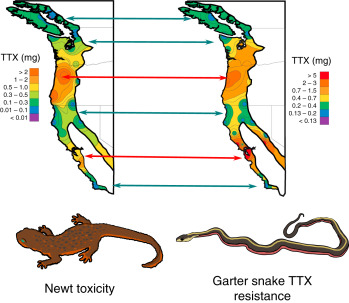

## Who am I?

- Postdoc at MSU with Gideon Bradburd

  - continuous space population genetics

- PhD with Scott Nuismer at UI (def June 2020)

  - developed phenotypic models of coevolution
  
    - studied coevolutionary maintenance of mutualism
  
  - methods to measure coevolution from trait data
  
  - studied diffusion limits of eco-evo models

## Coevolution


The reciprocal evolutionary response of two species to a shared ecological interaction

[(Image courtesy H. Toju)](https://sites.google.com/site/ecoltj/home/movie)

## Coevolution in space

```{r, echo=FALSE, message=FALSE, warning=FALSE, tidy=TRUE, comment='', fig.height=4, fig.width=6}
# read in data
require(ggplot2)
load("/home/bb/gits/genomic-sign-coev-cont-sp/lab-mtg/toju_pairs.Rda")
ggplot(toju_df,aes(x=rostrum,y=pericarp))+geom_point()+theme_minimal()+xlab("Rostrum length")+ylab("Pericarp thickness")
```

When this process plays out in spatially structured populations, characteristic patterns can emerge

[(Data courtesy Toju et al 2006)](https://doi.org/10.1086/498277)

## Measuring coevolution

- Simple models predict bivariate distribution of traits

- Can use maximum likelihood to infer strength of coevolution [(Week & Nuismer 2019)](https://doi.org/10.1111/ele.13231)

- Caveat: spatially implicit

  - Ignores isolation by distance (IBD)
  
  - Which can confound inference

- Accounting for IBD may increase power to detect coevolution

## Coevolution in continuous space



Courtesy [Powell & Prior (2016)](https://doi.org/10.1016/B978-0-12-800049-6.00188-8)

## Questions

- How do the spatial scales at which phenotypic patterns emerge depend on:

  - dispersal distances?
  
  - coevolutionary selection?

- How do spatial scales of local adaptation relate to spatial scales of phenotypic patterns?

- How can we use this information to identify loci involved in coevolution?

## Approach

- Develop continuous space phenotypic model accounting for:

  - limited dispersal
  
  - random genetic drift
  
  - spatially homogeneous abiotic stabilizing selection
  
  - biotic coevolutionary selection
  
    - focus on host-parasite interactions
    
## Why Host-Parasite Interactions?

- Ecologically important interaction

  - Thought to promote/maintain biodiversity
  
- Genetics are relatively well understood

  - Evidence for gene-for-gene mechanisms mediating _Linum marginale_ & _Melampsora lini_ coevolution [(Dodds et al 2006)](https://doi.org/10.1073/pnas.0602577103)
  
  - Evidence for balancing selection _Daphnia magna_ & _Pasteuria ramosa_ ([Bento et al 2017](https://doi.org/10.1371/journal.pgen.1006596), [Andras et al 2020](https://doi.org/10.1093/molbev/msaa173))

- Has motivated studies in local adaptation

## Outline of local (non-spatial) dynamics

- $H=$ host, $P=$ parasite

- Fitness $m_H,m_P$ determined by traits $z_H,z_P$

- Selection: $\mathrm{Cov}(m_H,z_H), \ \mathrm{Cov}(m_P,z_P)$

- Mean trait dynamics given by

  - $\frac{d}{dt}\bar z_H=\mathrm{Cov}(m_H,z_H)+\delta_H \\ \frac{d}{dt}\bar z_P=\mathrm{Cov}(m_P,z_P)+\delta_P$

  - $\delta_H,\delta_P$ are stochastic processes representing drift

## Trait-matching/mismatching<br>fitness model

```{r, echo=FALSE, warning=FALSE, message=FALSE, fig.width=8,fig.height=5}
require("ggplot2")
require("gridExtra")
require('latex2exp')
require('ggdark')

offsetmatching = function(D,Bx,By,d){ # D = x - y
  Wx = exp(-Bx*(D-d)^2/2)
  Wy = exp(-By*(D+d)^2/2)
  return(c(Wx,Wy))
}

traitdifferences = function(D,Bx,By){ # D = x - y
  Wx = exp( Bx*D)
  Wy = exp(-By*D)
  return(c(Wx,Wy))
}
Ds = seq(-1,1,0.001) # range of trait differences

td = NULL # container for trait-differences mechanism
om = NULL # container for offset-matching mechanism
for(D in Ds){
  td = rbind(td,traitdifferences(D,1.5,1))
  om = rbind(om,offsetmatching(D,10,-10,0))
}
td = 3*td/max(td) # scale max fitness to 3
om[,1] = 3*om[,1]
om[,2] = 0.25*om[,2]
om = log(om)
Fitness_df = data.frame(fit=c(td[,1],td[,2],om[,1],om[,2]), 
                        
                        Species=c( rep('Parasite',length(Ds)), rep('Host',length(Ds)), rep('Parasite',length(Ds)), rep('Host',length(Ds)) ),
                        
                        Mechanism=c( rep('TD',2*length(Ds)), rep('OM',2*length(Ds)) ),
                        
                        td=c(Ds,Ds,Ds,Ds))

OM_Fitness_df = subset(Fitness_df,Mechanism=='OM')

ggplot(data = OM_Fitness_df, aes(x=td,y=fit,linetype=Species)) + 
  
  # geom_vline(xintercept = -.5,linetype='dotted') + geom_vline(xintercept = .5,linetype='dotted') + 
  
  geom_line(size=1) + theme_minimal() + xlab(TeX('z_H-z_P')) + ylab('Fitness') +
  
  # annotate("text",x=0,y=-1.75,label=TeX('m_H \ = r_H \ + \ B_H(z_H-z_P)^2')) +
  
  # annotate("text",x=0,y=1.5,label=TeX('m_P \ = r_P \ - \ B_P(z_H-z_P)^2')) # + dark_mode()

  annotate("text",x=0,y=-1.75,label=TeX('m_H')) +
  
  annotate("text",x=0,y=1.5,label=TeX('m_P')) # + dark_mode()

```

## Coevolutionary selection

- $\mathrm{Cov}(m,z)=G\beta$

- $G_H,G_P=$ additive genetic variances

- $\beta_H,\beta_P=$ selection gradients

- $\beta_H = -B_H(\bar z_P-\bar z_H) \\ \beta_P = \ B_P(\bar z_H-\bar z_P)$

- $B_H,B_P=$ strengths of coevolutionary selection


## What it looks like

```{r, eval=FALSE, echo=FALSE}
require("ggplot2")
require('diffeqr')
require('latex2exp')
require('ggdark')

de <- diffeqr::diffeq_setup(JULIA_HOME = "/opt/julia-1.6.0/bin/")

f <- function(u,p,t){
  du = c(0,0)
  du[1] = p[1] * (-p[2]*(u[2]-u[1]) - 0.0 * u[1])
  du[2] = p[3] * ( p[4]*(u[1]-u[2]) - 0.0 * u[2])
  return(du)
}

g <- function(u,p,t){
  du = c(p[1]/p[5],p[3]/p[6])
  return(du)
}

pars <- c(10,0.01,10,0.05,1000,1000)
u0 <- c(0.1,-0.1)
tspan <- c(0,100)

prob = de$SDEProblem(f, g, u0, tspan, pars)
sol = de$solve(prob)
mat <- sapply(sol$u,identity)
udf <- data.frame(Time=c(sol$t,sol$t), Trait=c(mat[1,],mat[2,]), Species=c(rep("Host",length(sol$t)),rep("Parasite",length(sol$t))))
ggplot(data=udf,aes(x=Time,y=Trait,linetype=Species)) +
  geom_line(size=1) + theme_minimal() + xlab("Time") + ylab("Trait Value") # + dark_mode()

```


- But what about continuous space and limited dispersal?

## Adding Space

- 2D space ($x_1,x_2$)-coordinates

  - Assume offspring normally distributed around parents

  - $\frac{\partial\bar z_S}{\partial t}=\color{red}{G_S\beta_S}+\color{blue}{\frac{\sigma_S^2}{2}\left(\frac{\partial^2\bar z_S}{\partial x_1^2}+\frac{\partial^2\bar z_S}{\partial x_2^2}\right)}+\color{green}{\delta_S} \\ S=H,P$

  - $\sigma_H,\sigma_P\propto$ expected dispersal distances

## Abiotic stabilizing selection

- Need to add abiotic stabilizing selection to prevent runaway coevolution

- $\beta_H = \color{green}{A_H(\theta_H-\bar z_H)}-\color{blue}{B_H(\bar z_P-\bar z_H)} \\ \beta_P = \color{green}{A_P(\theta_P-\bar z_P)}+\color{blue}{B_P(\bar z_H-\bar z_P)}$

- $A_H,A_P=$ strengths of abiotic stabilizing selection

- $\theta_H,\theta_P=$ abiotic optimal trait values

## Caveats

- Assumes: 

  - weak coevolutionary selection ($B_H,B_P\ll1$),

  - spatially homogeneous selection strengths

  - spatially homogeneous abiotic environment

  - traits encoded by many additive small effect loci
  
  - constant population densities in space and time
  
  - constant additive genetic variances

## What it looks like

<video width="640" height="480" data-autoplay src="host-parasite-coevolution.mp4"></video>

- Can use theory of random fields to get spatial autocorrelation of trait values

## Matérn correlation function

```{r, echo=FALSE, warning=FALSE, message=FALSE, fig.width=8,fig.height=4}
require(geoR)
require(ggplot2)
require(ggdark)
require('latex2exp')
rng = seq(0,2,0.01)
M1df <- data.frame(Lag=rng, Corr=matern(rng*sqrt(2),1,1))
ggplot(data=M1df,aes(x=Lag,y=Corr)) +
  geom_line(size=1) + theme_minimal() + xlab(TeX('Normalized Spatial Lag, $h/\\xi$')) + ylab(TeX('Correlation')) +
  annotate("text",x=0.85,y=0.6,label=TeX('$M_1(h/\\xi)$'))
```

- $\xi=$ characteristic length scale

## Idea of characteristic length

- The geographical scale at which <br> spatial patterns emerge

## A Matérn random field

```{r, echo=FALSE, warning=FALSE, message=FALSE}
require(geoR)
require(ggplot2)
require(ggdark)
require('latex2exp')
Msim <- grf(10000, grid = "reg", cov.pars = c(1,.25/sqrt(2)),messages = FALSE)
image(Msim, xlab=TeX("x_1-coordinate"), ylab=TeX("x_2-coordinate"))
segments(0.5-.125,0.5,0.5+.125,0.5,lwd=3)
text(0.5,0.55,TeX('$\\xi$'),lwd=10)
```

## Spatial (intraspecific) covariance Functions

- $C_S(h)\approx V_SM_1(h/\xi_S), \ S=H,P$

  - $V_H = 1/N_H\sigma_H^2(A_H-B_H), \\ V_P = 1/N_P\sigma_P^2(A_P+B_P)$

  - $N_H,N_P=$ effective densities

  - $\xi_H= \frac{\sigma_H}{\sqrt{G_H(A_H-B_H)}}, \ \xi_P = \frac{\sigma_P}{\sqrt{G_P(A_P+B_P)}}$

## Effect of dispersal distance

```{r, echo=FALSE, warning=FALSE, message=FALSE, fig.height=5}
require("ggplot2")
require('latex2exp')
require("gridExtra")

sh = seq(2,10,0.01) # dispersal distances
sp = seq(2,10,0.01)
Gh = 10  # additive variances
Gp = 10
Ah = 0.01 # abiotic stabilizing selection
Ap = 0.01
Bh = seq(0,0.009,0.0001) # biotic selection
Bp = seq(0,0.009,0.0001)
Nh = 0.1
Np = 0.1

Vh_s = 1/(Nh*sh^2*(Ah-Bh[5]))
Vp_s = 1/(Np*sp^2*(Ap+Bp[5]))

xih_s = sh/sqrt(Gh*(Ah-Bh[5]))
xip_s = sp/sqrt(Gp*(Ap+Bp[5]))

xi_s = data.frame( s = c(sh,sp), xi = c(xih_s,xip_s), Species = c(rep('Host',length(sh)),rep('Parasite',length(sp))) )
V_s = data.frame( s = c(sh,sp), V = c(Vh_s,Vp_s), Species = c(rep('Host',length(sh)),rep('Parasite',length(sp))) )

xi_s_pl = ggplot(data=xi_s,aes(x=s,y=xi,linetype=Species)) +
  geom_line(size=1) + theme_minimal() + xlab(TeX("Dispersal Distance, $\\sigma$")) + ylab(TeX("Characteristic Length, $\\xi$")) + theme(legend.position = 'none')

V_s_pl = ggplot(data=V_s,aes(x=s,y=V,linetype=Species)) +
  geom_line(size=1) + theme_minimal() + xlab(TeX("Dispersal Distance, $\\sigma$")) + ylab(TeX("Marginal Variance, V"))

xih_B = sh[25]/sqrt(Gh*(Ah-Bh))
xip_B = sp[25]/sqrt(Gp*(Ap+Bp))

xi_B = data.frame( B = c(Bh,Bp), xi = c(xih_B,xip_B), Species = c(rep('Host',length(Bh)),rep('Parasite',length(Bp))) )

xi_B_pl = ggplot(data=xi_B,aes(x=B,y=xi,linetype=Species)) +
  geom_line(size=1) + theme_minimal() + xlab("Coevolutionary Selection") + ylab("")

grid.arrange(xi_s_pl,V_s_pl,ncol=2)

```

- Increased $\sigma$ leads to panmixia

## Effect of coevolution

```{r, echo=FALSE, warning=FALSE, message=FALSE, fig.height=5}
require("ggplot2")
require('latex2exp')
require("gridExtra")

sh = seq(2,10,0.01) # dispersal distances
sp = seq(2,10,0.01)
Gh = 10  # additive variances
Gp = 10
Ah = 0.01 # abiotic stabilizing selection
Ap = 0.01
Bh = seq(0,0.009,0.0001) # biotic selection
Bp = seq(0,0.009,0.0001)
Nh = 0.1
Np = 0.1

Vh_s = 1/(Nh*sh^2*(Ah-Bh[5]))
Vp_s = 1/(Np*sp^2*(Ap+Bp[5]))

xih_s = sh/sqrt(Gh*(Ah-Bh[5]))
xip_s = sp/sqrt(Gp*(Ap+Bp[5]))

xi_s = data.frame( s = c(sh,sp), xi = c(xih_s,xip_s), Species = c(rep('Host',length(sh)),rep('Parasite',length(sp))) )
V_s = data.frame( s = c(sh,sp), V = c(Vh_s,Vp_s), Species = c(rep('Host',length(sh)),rep('Parasite',length(sp))) )

xi_s_pl = ggplot(data=xi_s,aes(x=s,y=xi,linetype=Species)) +
  geom_line(size=1) + theme_minimal() + xlab(TeX("Dispersal Distance, $\\sigma$")) + ylab(TeX("Characteristic Length, $\\xi$")) + theme(legend.position = 'none')

V_s_pl = ggplot(data=V_s,aes(x=s,y=V,linetype=Species)) +
  geom_line(size=1) + theme_minimal() + xlab(TeX("Dispersal Distance, $\\sigma$")) + ylab(TeX("Marginal Variance, V")) + theme(legend.position = 'none')

xih_B = sh[25]/sqrt(Gh*(Ah-Bh))
xip_B = sp[25]/sqrt(Gp*(Ap+Bp))

Vh_B = 1/(Nh*sh[25]^2*(Ah-Bh))
Vp_B = 1/(Np*sp[25]^2*(Ap+Bp))

xi_B = data.frame( B = c(Bh,Bp), xi = c(xih_B,xip_B), Species = c(rep('Host',length(Bh)),rep('Parasite',length(Bp))) )
V_B = data.frame( B = c(Bh,Bp), V = c(Vh_B,Vp_B), Species = c(rep('Host',length(Bh)),rep('Parasite',length(Bp))) )

xi_B_pl = ggplot(data=xi_B,aes(x=B,y=xi,linetype=Species)) +
  geom_line(size=1) + theme_minimal() + xlab("Coevolutionary Selection, B") + ylab(TeX("Characteristic Length, $\\xi$")) + theme(legend.position = 'none')

V_B_pl = ggplot(data=V_B,aes(x=B,y=V,linetype=Species)) +
  geom_line(size=1) + theme_minimal() + xlab("Coevolutionary Selection, B") + ylab("Marginal Variance, V")

grid.arrange(xi_B_pl,V_B_pl,ncol=2)
```

- Coevolutionary selection leads to opposing outcomes in each species

## Questions

- How do the spatial scales at which phenotypic patterns emerge depend on:

  - dispersal distances? 'check sign'
  
  - coevolutionary selection? 'check sign'

- How do spatial scales of local adaptation relate to spatial scales of phenotypic patterns?

- How can we use this information to identify loci involved in coevolution?

## Measuring Local Adapation

- We have fitness functions $m_H(z_H,z_P),m_P(z_P,z_H)$

- So we can calculate difference in fitness for

  - local interactions (home) vs
  - interactions at a spatial lag $h$ (away)
  
- $\Delta_H(h)=B_H[C_{HP}(h)-C_{HP}(0)]$
- $\Delta_P(h)=B_P[C_{HP}(0)-C_{HP}(h)]$

  - $C_{HP}(h)=$ interspecific cross-covariance

- spatial scale of LA = spatial scale of $C_{HP}(h)$

## Spatial (interspecific) cross-covariance

- $C_{HP}(h)=$ correlation of mean traits between species separated by lag $h$

- $C_{HP}(h)\approx\frac{2}{\sigma_H^2\sigma_P^2}\left(\frac{G_HB_H}{N_P(A_P+B_P)}K_0(h/\xi_H)*M_1(h/\xi_P)\\-\frac{G_PB_P}{N_H(A_H-B_H)}K_0(h/\xi_P)*M_1(h/\xi_H)\right)$

- $K_0(h)=$ modified Bessel function of the second kind

- $*=$ convolution

- Can investigate using numerical convolution

<!-- - How to measure characteristic scale of cross-correlation? -->

<!-- ## Correlation radius -->

<!-- - leave this out! no need for correlation radius in msr of LA!! -->

<!-- - $\mathcal{R} :=\frac{\int \|x\|^2C(x)dx}{\int C(x)dx} = -\frac{\nabla^2\hat C(x)|_{x=0}}{\hat C(0)}$ -->

<!-- - exists for $C_H,C_P$ & $C_{HP}$! -->

<!--   - $\mathcal{R}_H=\frac{\sigma^2_H}{G_H(A_H-B_H)}, \ \mathcal{R}_P=\frac{\sigma^2_P}{G_P(A_P+B_P)}$ -->

<!--   - $\mathcal{R}_H=\xi_H^2, \ \mathcal{R}_P=\xi_P^2$ -->

<!--   - $\xi_{HP}:=\sqrt{|\mathcal{R}_{HP}|}$ -->

<!-- ## Characteristic length of interspecific phenotypic variation -->

<!-- ```{r, echo=FALSE, warning=FALSE, message=FALSE, fig.height=5} -->
<!-- xihp <- function(Ah,Ap,Bh,Bp,sh,sp,Gh,Gp,Nh,Np){ -->
<!--   val = sqrt(abs( 2*(Ah-Bh)*Bh*Gh*(2*(Ah-Bh)*(sp^2)*Gh+(Ap+Bp)*(sh^2)*Gp)*Nh - -->
<!--                     2*Bp*(Ap+Bp)*Gp*((Ah-Bh)*(sp^2)*Gh+2*(Ap+Bp)*(sh^2)*Gp)*Np / -->
<!--                     ((Ah-Bh)*(Ap+Bp)*Gh*Gp*((Ah-Bh)*Bh*Gh*Nh-Bp*(Ap+Bp)*Gp*Np)) )) -->
<!--   return(val) -->
<!-- } -->

<!-- sh = seq(0,100,1) # dispersal distances -->
<!-- sp = seq(0,100,1) -->
<!-- Gh = 10  # additive variances -->
<!-- Gp = 10 -->
<!-- Ah = 0.2 # abiotic stabilizing selection -->
<!-- Ap = 0.2 -->
<!-- Bh = seq(0.01,0.09,0.00001) # biotic selection -->
<!-- Bp = seq(0.01,0.09,0.00001) -->
<!-- Nh = 100 -->
<!-- Np = 100 -->


<!-- xihp_Bh = xihp(Ah,Ap,Bh,Bp[5],sh[50],sp[50],Gh,Gp,Nh,Np) -->
<!-- xihp_Bp = xihp(Ah,Ap,Bh[500],Bp,sh[50],sp[50],Gh,Gp,Nh,Np) -->
<!-- xihp_sh = xihp(Ah,Ap,Bh[500],Bp[1000],sh,sp[50],Gh,Gp,Nh,Np) -->
<!-- xihp_sp = xihp(Ah,Ap,Bh[500],Bp[1000],sh[50],sp,Gh,Gp,Nh,Np) -->

<!-- # fixing Bh = 0.05 -->
<!-- par(mfcol = c(1, 2)) -->
<!-- plot(Bh,xihp_Bh,type='l',ylim=c(0,1000),ylab="Characteristic Length",xlab="Coevolutionary Selection") -->
<!-- lines(Bp,xihp_Bp,lty='dashed') -->
<!-- plot(sh,xihp_sh,type='l',ylim=c(200,520),ylab="Characteristic Length",xlab="Dispersal Distance") -->
<!-- lines(sp,xihp_sp,lty='dashed') -->

<!-- ``` -->

## Local adapation


- Decreased fitness with spatial lag $\implies$ LA

## Local adaptation<br> as function of dispersal


- The shorter disperser tends to be locally adapted

## Local adaptation<br> as function of coevolution


- The species experiencing weaker biotic selection tends to be locally adapted, but the signal is faint

## Next Steps

1. Check model results using simulations relaxing key assumptions

2. Work toward statistical inference method for identifying loci mediating coevolutionary interactions in continuous space

  - Tricky because continuous space can lead to IBD and spurious interspecific spatial correlations of allele frequencies

  - How can we control for interspecific genetic linkage due to IBD?

<!-- # Genetically Explicit <br> (SLiM) -->

<!-- ## SLiM model details -->


<!-- - tbd -->

<!-- ## Goals -->

<!-- - Determine conditions that validate/invalidate infinitesimal model -->

<!-- - Develop a statistic based on interspecific correlations of allele frequencies and trait values to detect coevolution -->

<!--   - correct for LD created by IBD -->
