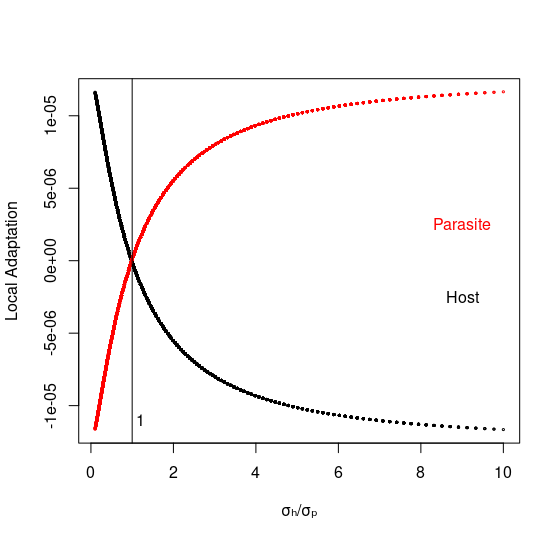

## Coevolution can lead to 

spatial mosaics of phenotypic and genomic diversity

- Classically: interspecific spatial correlation $\implies$ coevolution

  - Not true since other processes can generate correlation
  
  - In particular, spatial autocorrelation due to limited dispersal
  
## Two projects

focused on disentangling spatial patterns due to 

coevolution, limited dispersal and drift

- Phenotypic (math)
- Genomic (slim)

- Focusing on phenotypic model today

## Goals

- Approximate spatial scales of phenotypic turnover and coadaptation
- Introduce measures of local adaptation for continuously distributed populations
- Use results to determine which species is locally adapted
  - As function of relative dispersal abilities and strengths of selection
- Test accuracy of math using simulations (_not_ slim)
  - Benefit: allows us to relax key assumptions
  - Cost: mapping simulation parameters to math parameters is hard
    - e.g. no such thing as interaction radius in math model

## The model

- 2D habitat
- Offspring location bivariate normal around parental location
- Interaction is host-parasite
- Single trait mediates interaction
- Drift captured by Gaussian noise in evolution of (local) mean traits

## Key assumptions

- Spatially homogeneous:
  - abundance densities
  - additive genetic and phenotypic variances
- Weak coevolutionary selection

## Spatial scales of phenotypic turnover

$$\xi_H = \frac{\sigma_H}{\sqrt{G_H(A_H-B_H)}}, \ \xi_P = \frac{\sigma_P}{\sqrt{G_P(A_P+B_P)}}$$

- $\sigma_H,\sigma_P=$ dispersal distances
- $G_H,G_P=$ additive genetic variances
- $A_H,A_P=$ strengths of abiotic selection
- $B_H,B_P=$ strengths of biotic selection

## Spatial scale of coadaptation?

- Spatial (interspp) cross-cov function analytically intractable
- How to measure spatial scale of coadaptation?
- Plan:
  1. Numerically compute cross-cov function
  2. Fit a widely-employed spatial cov function to theoretical result
  3. Fit same function to simulated results to assess accuracy

## Local adaptation

$$\mathcal{L}_H = -B_H\mathrm{Cov}(\bar z_H,\bar z_P)$$

$$\mathcal{L}_P = B_P\mathrm{Cov}(\bar z_H,\bar z_P)$$

- $\bar z_H,\bar z_P=$ local mean traits
- $B_H,B_P=$ strengths of biotic selection

## Local adaptation as function of relative dispersal distances



## Testing theory with simulations

- Individual-based simulations
- Requires fitness functions (expd offspg num)
  - Theory uses growth rates
  - How to relate?
  
- Math! (theory of diffusion-limits in particular)

## Mapping parameters

Additive genetic variance

$$G_P\approx \sqrt{\mu_P/(A_P+B_P)}$$

Population density

$$\rho_P\approx \frac{1}{\ln\kappa_P}\Big(r_P-\frac{1}{2}\sqrt{\mu_P(A_P+B_P)}\Big),$$

Growth rate

$$r_P\approx\ln\alpha_P+\pi_{\max}(\iota_P-1)\big(1-e^{-2\pi R_\iota^2\rho_H}\big),$$

Strength of biotic selection

$$B_P\approx\gamma\pi_{\max}(\iota_P-1)\big(1-e^{-2\pi R_\iota^2\rho_H}\big)$$

## How well does it do?

```{r echo=F, warning=FALSE}
host_df1 = read.csv("julia/ibm/host_df1.csv");
para_df1 = read.csv("julia/ibm/para_df1.csv");

# to get rho_S, drop a few disks of radius R_S
# make sure they don't intersect
# then estimate rho_S by average density of inds in each disk

ndisk = 20
RH = 0.005	# competition radii
RP = 0.005

# pick their centers, calulate distance & count individuals
centersH = matrix(runif(2*ndisk, min=RH, max=1-RH),ndisk,2)
centersP = matrix(runif(2*ndisk, min=RP, max=1-RP),ndisk,2)
distsH = matrix(0,ndisk,ndisk)
distsP = matrix(0,ndisk,ndisk)
for(i in 1:ndisk){
  for(j in 1:ndisk){
    distsH[i,j] = sqrt( sum((centersH[i,]-centersH[j,])^2) )
    distsP[i,j] = sqrt( sum((centersP[i,]-centersP[j,])^2) )
  }
}
indsH = list()
indsP = list()
nindsH = rep(0,3)
nindsP = rep(0,3)
for(i in 1:ndisk){
  indsH[[i]] = which(rowSums((cbind(host_df1$x1,host_df1$x2)-centersH[i,])^2)<RH)
  indsP[[i]] = which(rowSums((cbind(para_df1$x1,para_df1$x2)-centersP[i,])^2)<RP)
  nindsH[i] = length(indsH[[i]])
  nindsP[i] = length(indsP[[i]])
}

# ensures they're not overlapping, not empty and not too close to the edge
mH = min(distsH[upper.tri(distsH)])
mP = min(distsP[upper.tri(distsP)])
while(mH<(2*RH) | min(nindsH)==0){
  centersH = matrix(runif(2*ndisk, min=RH, max=1-RH),ndisk,2)
  for(i in 1:ndisk){
   for(j in 1:ndisk){
      distsH[i,j] = sqrt( sum((centersH[i,]-centersH[j,])^2) )
    }
  }
  mH = min(distsH[upper.tri(distsH)])
  for(i in 1:ndisk){
    indsH[[i]] = which(rowSums((cbind(host_df1$x1,host_df1$x2)-centersH[i,])^2)<RH)
    nindsH[i] = length(indsH[[i]])
  }
}
while(mP<(2*RP) | min(nindsP)==0){
  centersP = matrix(runif(2*ndisk, min=RP, max=1-RP),ndisk,2)
  for(i in 1:ndisk){
   for(j in 1:ndisk){
      distsP[i,j] = sqrt( sum((centersP[i,]-centersP[j,])^2) )
    }
  }
  mP = min(distsP[upper.tri(distsP)])
  for(i in 1:ndisk){
    indsP[[i]] = which(rowSums((cbind(para_df1$x1,para_df1$x2)-centersP[i,])^2)<RP)
    nindsP[i] = length(indsP[[i]])
  }
}

zbarH_vec = rep(0,ndisk)
zbarP_vec = rep(0,ndisk)
GH_vec = rep(0,ndisk)
GP_vec = rep(0,ndisk)
for(i in 1:ndisk){
  zbarH_vec[i] = mean(host_df1$trait[indsH[[i]]])
  zbarP_vec[i] = mean(para_df1$trait[indsP[[i]]])
  GH_vec[i] = var(host_df1$trait[indsH[[i]]])
  GP_vec[i] = var(para_df1$trait[indsP[[i]]])
}

GH_hat = mean(GH_vec)
GP_hat = mean(GP_vec)

pi = 3.14159

rhoH_hat = mean(nindsH) #/(pi*RH^2)
rhoP_hat = mean(nindsP) #/(pi*RP^2)

rhoH_var = var(nindsH) #/(pi*RH^2)
rhoP_var = var(nindsP) #/(pi*RP^2)

gamma = 0.1
pimax = 1.0
Ri = 0.01

iotaP = 1.1
alphP = 1.2
kappaP = 0.98
muP = 0.1
EP = 0.001
AP = 0.002

iotaH = 0.99
alphH = 1.4
kappaH = 0.975
EH = 0.001
muH = 0.1
AH = 0.002

minthis = function(X){
  
  rhoH = X[1]
  rhoP = X[2]
  BP = gamma*pimax*(iotaP-1)*(1-exp(-2*pi*Ri^2*rhoH))
  vP = EP + sqrt(muP/(AP+BP))
  BH = -gamma*pimax*(iotaH-1)*rhoP/rhoH 
  
  rP = log(alphP)+pimax*(iotaP-1)*(1-exp(-2*pi*Ri^2*rhoH))
  rH = log(alphH)+pimax*(iotaH-1)*(1-gamma*vP/2)*rhoP/rhoH
  
  out = c((rhoH+(rH-0.5*sqrt(muH*abs(AH-BH)))/log(kappaH))^2,
          (rhoP+(rP-0.5*sqrt(muP*(AP+BP)))/log(kappaP))^2 )
  
  return(sqrt(sum(out)))
}

num_rho = optim(rexp(2,1/10),minthis)

rhoH = num_rho$par[1] #/(2*pi*RH^2)
rhoP = num_rho$par[2] #/(2*pi*RP^2)

BP = gamma*pimax*(iotaP-1)*(1-exp(-2*pi*Ri^2*rhoH))
vP = EP + sqrt(muP/(AP+BP))
BH = -gamma*pimax*(iotaH-1)*rhoP/rhoH 
vH = EH + sqrt(muH/(AH-BH))
rP = log(alphP)+pimax*(iotaP-1)*(1-exp(-2*pi*Ri^2*rhoH))
rH = log(alphH)+pimax*(iotaH-1)*(1-gamma*vP/2)*rhoP/rhoH
GH = sqrt(muH/(AH-BH))
GP = sqrt(muP/(AP+BP))


ExpObs.df = data.frame(Parameter=c("host density","parasite density", "host G", "parasite G"), Expectation=c(rhoH, rhoP, GH, GP), Observation=c(rhoH_hat, rhoP_hat, GH_hat, GP_hat))
```


- To evaluate, toss down 20 disks for each spp
  - Radius equal to competition radius for each spp
  - Measure population density and additive genetic var within each disk
  - Average across disks for an estimate
- Result: 
  ```{r echo=F, warning=FALSE}
print(ExpObs.df)
```

  <!-- - Expected host density `r rhoH` -->
  <!-- - Observed host density `r rhoH_hat` -->
  <!-- - Expected parasite density `r rhoP` -->
  <!-- - Observed parasite density `r rhoP_hat` -->
  <!-- - Expected host density `r rhoH` -->
  <!-- - Observed host density `r rhoH_hat` -->
  <!-- - Expected parasite density `r rhoP` -->
  <!-- - Observed parasite density `r rhoP_hat` -->


<!-- ## Phenotype$\times$distance plots -->

<!-- ```{r, echo=F, warning=F, fig.height=3} -->
<!-- # source("R/ibm/geo-pheno.R") -->
<!-- ``` -->


<!-- ## Phenotype$\times$distance plots -->

<!-- ```{r, echo=F, warning=F, fig.height=3} -->
<!-- # source("R/ibm/geo-pheno.R") -->
<!-- ``` -->

